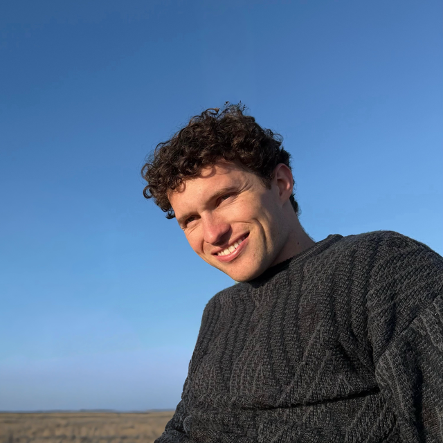

# CLIPDraw: Synthesize drawings to match images or text

This repo is based on presents CLIPDraw ([paper](https://arxiv.org/abs/2106.14843), [github](https://github.com/kvfrans/clipdraw/tree/main)).

**From the orginal repo**: *CLIPDraw* is an algorithm that synthesizes novel drawings based on natural language input. CLIPDraw does not require any training; rather a pre-trained CLIP language-image encoder is used as a metric for maximizing similarity between the given description and a generated drawing. Crucially, CLIPDraw operates over vector strokes rather than pixel images, a constraint that biases drawings towards simpler human-recognizable shapes. Results compare between CLIPDraw and other synthesis-through-optimization methods, as well as highlight various interesting behaviors of CLIPDraw, such as satisfying ambiguous text in multiple ways, reliably producing drawings in diverse artistic styles, and scaling from simple to complex visual representations as stroke count is increased.

**What this repo adds**: Ability to add other losses, such as CLIP loss with other images, or MSE loss with other images. You can provide a mask to give part of the image one loss (e.g. MSE to photo) and another part of the image another loss (e.g. CLIP loss to prompt). Additionally, you can cycle through optimization targets (reference photos, prompts) to create a single smooth animation.

## Example

For example, the gif below was created using a mix of an MSE loss to a reference photo and CLIP loss to a text caption:


This was created using the following:

<p>
  
  
</p>

And the text prompts **"a beautiful sunset" "hubble space telescope photo showing galactic explosion" "an image of TRIPLE rainbows" "psychedelic fractals and spirals" "underwater coral and jellyfish"**.

`assets/` contains the exact reference bundle used for the published website version:

- `assets/prof.png` -- reference photo
- `assets/prof-mask.png`
- `assets/prof-nonmask.png`
- `assets/progress.gif`

To rerun the same prompt schedule:

```bash
python run_clipdraw.py \
    --ref-image assets/prof.png \
    --ref-loss-type mse \
    --ref-mask assets/prof-mask.png \
    --prompt " " "a beautiful sunset" \
    "hubble space telescope photo showing galactic explosion" \
    "an image of TRIPLE rainbows" \
    "psychedelic fractals and spirals" \
    "underwater coral and jellyfish" \
    --prompt-mask assets/prof-nonmask.png \
    --output-dir outputs/website-demo \
    --num-paths 512 \
    --num-iter 3000 \
    --save-every 10 \
    --phase-lr-reset \
    --phase-optim-reset
```

## Copyright

```
Copyright 2022 Kevin Frans

Licensed under the Apache License, Version 2.0 (the "License");
you may not use this file except in compliance with the License.
You may obtain a copy of the License at

    http://www.apache.org/licenses/LICENSE-2.0

Unless required by applicable law or agreed to in writing, software
distributed under the License is distributed on an "AS IS" BASIS,
WITHOUT WARRANTIES OR CONDITIONS OF ANY KIND, either express or implied.
See the License for the specific language governing permissions and
limitations under the License.
```
